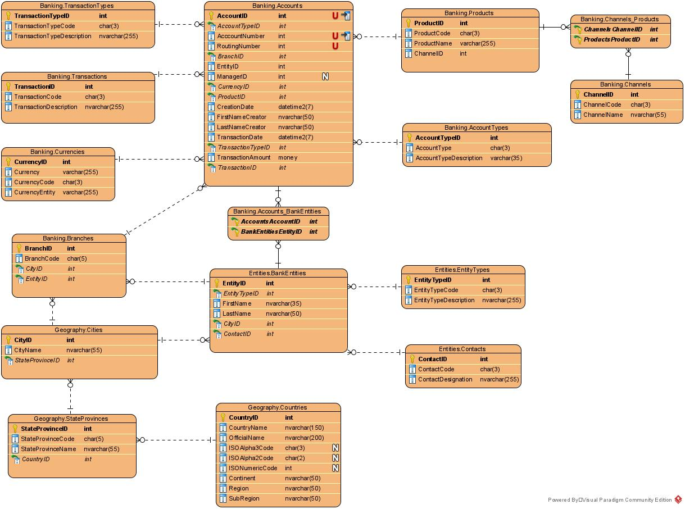

# InterContinentalBankers
**InterContinental Bankers** is a fictitious banking institution that operates globally. It operates in *North America, Latin-America, Europe, and Africa.*
It's a retailer Bank offering the following products:
- Checking accounts
- Savings accounts
- Credit and debit cards from these brands: **VISAFict, MasterFict, and FictAmExpr**
- Personal, Auto, and Mortgage Loans

***InterContinentalBankers*** is a Microsoft SQL Server Database designed as an OLTP system to capture, store, and process transactional workloads. This is a draft version and has no data in its tables yet. So, this is a working in progress, and I will be making updates as its tables got populated and other transactions, take place.
## Content of this Repository:
- InterContinentalBankers.sln: It is a Visual Studio file solution if you want to build the database using this method.
- InterContinentalBankers.dacpac: Another way to create this Database
- InterContinentalBankers.bacpac: When the database was created, there was no data in it.
- InterContinentalBankersERGenerated202206141932.sql: Scripts originally generated from the ERD.
- InterContinentalBankersWithSchemas.jpg: A file that depicts InterContinentalBankers ERD diagram.   

### ERD Diagram
The ERD diagram I have designed as the blurprint to creating the InterContinentalBankers OLTP database.

